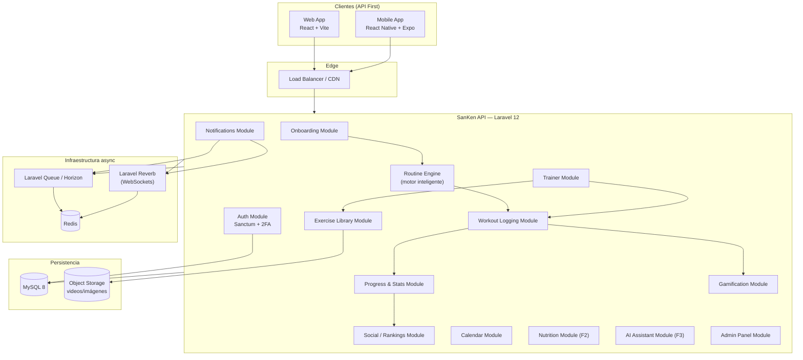
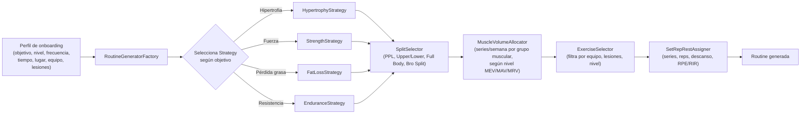

# SanKen — Arquitectura de Software

## 1. Principios rectores

- **API First**: el backend Laravel expone únicamente una API REST versionada. Web (React) y móvil (React Native/Expo) son clientes puros de esa API. Ningún cliente tiene lógica de negocio propia.
- **Clean Architecture**: dependencias apuntando siempre hacia adentro (dominio). Los casos de uso no conocen Eloquent, HTTP ni Redis.
- **Repository Pattern**: el dominio habla con interfaces (`UserRepositoryInterface`), nunca con modelos Eloquent directamente.
- **Service Layer**: los Controllers son delgados (validan input, llaman a un Service/Action, devuelven Resource). Toda regla de negocio vive en Services o Actions.
- **SOLID** en cada capa, especialmente en el motor de rutinas (Strategy Pattern para algoritmos de periodización, Factory para generación de planes).
- **Modularidad**: el código se organiza por dominio (módulos), no por tipo técnico. Cada módulo es casi un mini-paquete.
- **Multi-tenant lógico**: Usuario y Entrenador comparten esquema de datos pero con separación estricta de permisos vía Policies + Sanctum abilities.

## 2. Stack tecnológico

### Backend
| Componente | Tecnología | Uso |
|---|---|---|
| Framework | Laravel 12 / PHP 8.4 | API REST, orquestación |
| Base de datos | MySQL 8 | Persistencia transaccional |
| Cache / Colas / Sesiones | Redis 7 | Cache, rate limiting, Horizon queues |
| Colas | Laravel Queue + Horizon | Cálculo de rutinas, notificaciones, XP, rankings |
| Tiempo real | Laravel Reverb | Chat entrenador-cliente, notificaciones live, rankings en vivo |
| Auth | Laravel Sanctum | Tokens SPA/móvil + abilities por rol |
| Búsqueda (Fase 2+) | Meilisearch/Algolia | Búsqueda de ejercicios, entrenadores (marketplace) |
| Storage | S3-compatible (Cloudflare R2 / AWS S3) | Videos de ejercicios, imágenes de progreso |
| Observabilidad | Laravel Pulse + Sentry | Monitoreo de performance y errores |

### Frontend Web
React 18 + Vite + TypeScript + TailwindCSS + Shadcn UI + TanStack Query (data fetching/cache) + Zustand (estado UI ligero) + Recharts/Visx (gráficas) + React Hook Form + Zod.

### Móvil
React Native + Expo (EAS Build) + mismo stack de estado/datos que web (TanStack Query, Zustand) para máxima reutilización de lógica vía paquete compartido `@sanken/core` (hooks, tipos, cliente API).

### Infraestructura (visión de escala)
- Contenedores Docker, orquestados con Laravel Sail en dev y Kubernetes/ECS en producción.
- Load balancer → múltiples instancias PHP-FPM (stateless) → MySQL primario + réplicas de lectura.
- Redis en modo cluster para cache/colas a partir de Fase 2.
- CDN (Cloudflare) delante de assets estáticos, videos e imágenes.
- Horizon con colas separadas por prioridad: `routines` (cálculo de planes), `notifications`, `rankings`, `default`.

## 3. Diagrama de módulos (alto nivel)



## 4. Separación Usuario vs Entrenador

Ambos módulos comparten **el mismo backend, la misma base de datos y el mismo sistema de autenticación**, pero:

- **Un usuario tiene un `role`** (`user`, `trainer`, `admin`) y opcionalmente una relación `trainer_client` que vincula a un usuario entrenado con un entrenador.
- **Frontend**: dos "shells" de aplicación completamente distintos (rutas, navegación, componentes) que se activan según el rol tras login. En móvil, dos flujos de navegación (Stack Navigators) diferentes bajo un mismo binario, o apps separadas publicadas desde el mismo monorepo si el negocio lo requiere más adelante.
- **Backend**: Policies (`WorkoutPolicy`, `RoutinePolicy`, `ClientPolicy`) deciden si una rutina fue generada automáticamente (`source = engine`) o asignada manualmente por un entrenador (`source = trainer`). El motor de rutinas **nunca sobrescribe** una rutina creada por un entrenador.
- Un usuario "normal" puede **convertirse en cliente de un entrenador** en cualquier momento (Fase 2 — marketplace); en ese momento el control de sus rutinas pasa a ser manual, y el motor automático queda en pausa para ese usuario mientras dure la relación.

## 5. Clean Architecture — capas dentro de Laravel

```
app/
├── Domain/                          # Núcleo de negocio, sin dependencias de Laravel
│   ├── User/
│   │   ├── Entities/
│   │   ├── ValueObjects/            # Weight, Height, RPE, OneRepMax...
│   │   └── Contracts/
│   │       └── UserRepositoryInterface.php
│   ├── Routine/
│   │   ├── Entities/                # Routine, RoutineDay, RoutineExercise
│   │   ├── Strategies/              # HypertrophyStrategy, StrengthStrategy, EnduranceStrategy
│   │   ├── Contracts/
│   │   │   ├── RoutineRepositoryInterface.php
│   │   │   └── RoutineGeneratorInterface.php
│   │   └── Services/
│   │       └── ProgressiveOverloadCalculator.php
│   ├── Workout/
│   ├── Progress/
│   ├── Ranking/
│   └── Gamification/
│
├── Application/                     # Casos de uso (orquestan Domain + Infra)
│   ├── Onboarding/
│   │   └── Actions/CompleteOnboardingAction.php
│   ├── Routine/
│   │   └── Actions/
│   │       ├── GenerateRoutineAction.php
│   │       ├── RecalculateNextSessionAction.php
│   │       └── AssignManualRoutineAction.php
│   ├── Workout/
│   │   └── Actions/LogWorkoutSessionAction.php
│   └── Trainer/
│       └── Actions/CreateClientAction.php
│
├── Infrastructure/                  # Implementaciones concretas
│   ├── Persistence/
│   │   └── Eloquent/
│   │       ├── Models/              # User, Routine, Workout, Exercise...
│   │       └── Repositories/        # EloquentUserRepository implements UserRepositoryInterface
│   ├── Cache/
│   ├── Broadcasting/                # Reverb events
│   └── ExternalServices/            # AppleHealth, GoogleFit, Garmin adapters (Fase 2)
│
├── Http/                            # Adaptadores de entrada
│   ├── Controllers/Api/V1/
│   ├── Requests/                    # FormRequests (validación)
│   ├── Resources/                   # API Resources (transformación de salida)
│   ├── Middleware/
│   └── Policies/
│
└── Providers/
    └── RepositoryServiceProvider.php  # Bindea interfaces -> implementaciones Eloquent
```

**Regla de dependencia**: `Http` → `Application` → `Domain` ← `Infrastructure`. El `Domain` no importa nada de `Illuminate\*`. Esto permite testear el motor de rutinas con PHPUnit puro, sin booteae de Laravel, y permite cambiar de ORM/DB en teoría sin tocar reglas de negocio.

## 6. Motor de rutinas — diseño técnico

Patrón: **Strategy + Factory + Chain of Responsibility**.



- **Volumen**: usa rangos MEV/MAV/MRV (Mínimo/Máximo Volumen Efectivo/Recuperable) por grupo muscular según nivel (principiante/intermedio/avanzado), tabla configurable en `domain_config` (no hardcoded).
- **Selección de ejercicios**: filtra la biblioteca de ejercicios por `equipment_available`, excluye ejercicios contraindicados según `injuries`, prioriza compuestos antes que aislamiento (orden de ejecución).
- **Series/reps/descanso/RIR**: derivados del objetivo (hipertrofia: 6-15 reps, RIR 1-3, descanso 60-120s; fuerza: 1-6 reps, RIR 1-3, descanso 2-5min; resistencia: 15-25 reps, descanso 30-60s).
- **Sobrecarga progresiva**: `ProgressiveOverloadCalculator` recibe el historial de la última sesión de ese ejercicio + el flag `completed_all_sets`. Si completó todo con RIR objetivo → sugiere +2.5%/+5% de carga o +1 rep. Si falló → mantiene o reduce carga (double progression / deload automático tras N fallos consecutivos).
- Todo el motor corre **de forma asíncrona en cola** (`routines` queue) cuando genera un plan completo de 4-6 semanas, para no bloquear el request HTTP; el recálculo de "siguiente sesión" (un solo día) puede ser síncrono por ser liviano.

## 7. Seguridad

- Laravel Sanctum (tokens personales para móvil, cookies SPA para web).
- 2FA opcional (TOTP, `pragmarx/google2fa` o similar).
- Rate limiting por usuario/IP vía Redis (`throttle:api` + reglas específicas en auth y endpoints sensibles).
- Policies por recurso (un usuario nunca puede leer/escribir datos de otro usuario salvo relación entrenador-cliente explícita y aceptada).
- Encriptación de datos sensibles en reposo (campos como notas médicas/lesiones vía `encrypted` cast de Laravel).
- CORS estricto, Content Security Policy en el frontend, sanitización de inputs, protección CSRF en el flujo SPA de Sanctum.
- Auditoría: tabla `audit_logs` para acciones administrativas y cambios sensibles (baneos, cambios de rol).

## 8. Escalabilidad — decisiones clave

- Backend **stateless**: cualquier instancia puede atender cualquier request (sesión/token en Redis/DB, no en memoria local).
- Lecturas pesadas (rankings, dashboards) se sirven desde **vistas materializadas / tablas de agregados** (`user_stats_daily`, `ranking_snapshots`) recalculadas por jobs programados, no con `COUNT`/`SUM` en caliente sobre millones de filas.
- Particionamiento futuro de `workout_sets` por rango de fecha si el volumen lo exige.
- Cache de lectura en Redis para: perfil de usuario, rutina activa, rankings (TTL corto + invalidación por evento).
- Eventos de dominio (`WorkoutCompleted`, `PersonalRecordBroken`, `RoutineGenerated`) disparan listeners en cola que actualizan stats, XP, logros y rankings de forma desacoplada (Event Sourcing ligero, no CQRS completo en MVP pero preparado para migrar).
