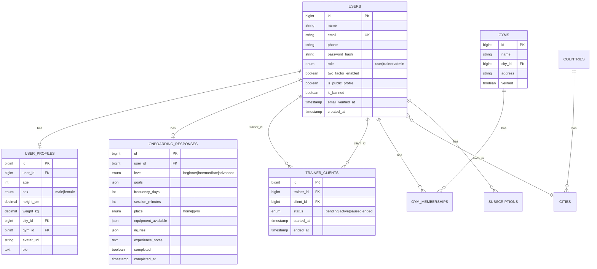
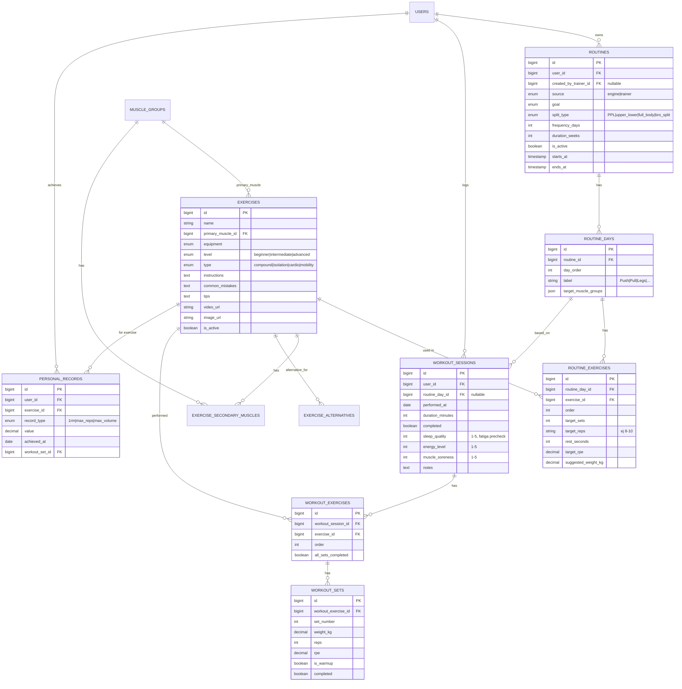

# SanKen — Modelo de Datos y Base de Datos

Motor: **MySQL 8**, InnoDB, `utf8mb4`. Todas las tablas con `id BIGINT UNSIGNED AUTO_INCREMENT`, `created_at`, `updated_at`, y `deleted_at` (soft deletes) donde aplique borrado lógico. Claves foráneas con `ON DELETE RESTRICT` salvo que se indique lo contrario.

## 1. ERD — núcleo (Identidad, Onboarding, Entrenador-Cliente)



## 2. ERD — Motor de rutinas y ejecución de entrenamientos



## 3. ERD — Progreso, Estadísticas, Social, Gamificación

```mermaid
erDiagram
    USERS ||--o{ BODY_MEASUREMENTS : logs
    USERS ||--o{ USER_STATS_DAILY : has
    USERS ||--o{ USER_XP : has
    USERS ||--o{ USER_ACHIEVEMENTS : earns
    ACHIEVEMENTS ||--o{ USER_ACHIEVEMENTS : "unlocked by"
    USERS ||--o{ RANKING_SNAPSHOTS : "appears in"
    USERS ||--o{ CHALLENGE_PARTICIPANTS : joins
    CHALLENGES ||--o{ CHALLENGE_PARTICIPANTS : has
    USERS ||--o{ NOTIFICATIONS : receives
    USERS ||--o{ CALENDAR_EVENTS : has

    BODY_MEASUREMENTS {
        bigint id PK
        bigint user_id FK
        date measured_at
        decimal weight_kg
        decimal body_fat_pct
        decimal chest_cm
        decimal waist_cm
        decimal hip_cm
        decimal arm_cm
        decimal thigh_cm
        string progress_photo_url
    }
    USER_STATS_DAILY {
        bigint id PK
        bigint user_id FK
        date stat_date
        int workouts_count
        int total_sets
        decimal total_volume_kg
        int training_minutes
        int current_streak_days
    }
    USER_XP {
        bigint id PK
        bigint user_id FK
        int total_xp
        int current_level
        timestamp last_xp_at
    }
    ACHIEVEMENTS {
        bigint id PK
        string code UK
        string name
        text description
        string icon_url
        enum tier "bronze|silver|gold|diamond"
        json unlock_criteria
    }
    USER_ACHIEVEMENTS {
        bigint id PK
        bigint user_id FK
        bigint achievement_id FK
        timestamp unlocked_at
    }
    RANKING_SNAPSHOTS {
        bigint id PK
        bigint user_id FK
        enum category "bench_press|squat|deadlift|pullups|consistency|volume|..."
        enum scope "global|country|city|gym|age_group|sex"
        decimal value
        int rank_position
        date snapshot_date
    }
    CHALLENGES {
        bigint id PK
        string title
        text description
        enum type "weekly|monthly"
        json criteria
        date starts_at
        date ends_at
    }
    CHALLENGE_PARTICIPANTS {
        bigint id PK
        bigint challenge_id FK
        bigint user_id FK
        decimal progress_value
        boolean completed
    }
    NOTIFICATIONS {
        bigint id PK
        bigint user_id FK
        string type
        json data
        timestamp read_at
    }
    CALENDAR_EVENTS {
        bigint id PK
        bigint user_id FK
        enum type "workout_planned|workout_completed|reminder|custom"
        date event_date
        bigint routine_day_id FK "nullable"
        string title
    }
```



## 4. Tablas de soporte (catálogo / sistema)

| Tabla | Propósito |
|---|---|
| `countries`, `cities` | Catálogo geográfico normalizado para rankings por ubicación |
| `muscle_groups` | Catálogo (Pecho, Espalda, Hombro, Bíceps, Tríceps, Cuádriceps, Isquios, Glúteo, Core, Pantorrilla...) |
| `exercise_secondary_muscles` | Pivote N:M `exercise_id` ↔ `muscle_id` |
| `exercise_alternatives` | Pivote N:M `exercise_id` ↔ `alternative_exercise_id` (para "modo gimnasio ocupado") |
| `gym_memberships` | Pivote `user_id` ↔ `gym_id` (para ranking por gimnasio) |
| `subscriptions` | `user_id`, `plan (free/premium)`, `provider`, `status`, `renews_at` |
| `training_plans_marketplace` (F2) | Planes que un entrenador vende, `trainer_id`, `price`, `routine_template_id` |
| `routine_templates` | Plantillas reutilizables de un entrenador (`is_template = true` sobre `routines`) |
| `trainer_notes` | Notas privadas del entrenador sobre un cliente |
| `chat_conversations`, `chat_messages` | Chat entrenador-cliente (vía Reverb) |
| `domain_config` | Tablas de configuración del motor: rangos MEV/MAV/MRV por nivel, plantillas de split, tabla de RIR por objetivo — **editable sin deploy** |
| `audit_logs` | `admin_id`, `action`, `target_type`, `target_id`, `payload`, para panel administrativo |
| `reports` | Reportes de usuarios (abuso, contenido) para moderación |
| `news_promotions` | Noticias/promociones publicadas por admin |
| `food_items`, `meal_logs`, `barcode_cache` | Fase 2 — nutrición |
| `wearable_connections` | Fase 2 — tokens OAuth Apple Health/Google Fit/Garmin/Fitbit |

## 5. Índices críticos (rendimiento a escala)

```sql
-- Búsquedas de rutina activa por usuario (lectura muy frecuente)
CREATE INDEX idx_routines_user_active ON routines (user_id, is_active);

-- Historial de entrenamientos ordenado por fecha (paginación de historial)
CREATE INDEX idx_workout_sessions_user_date ON workout_sessions (user_id, performed_at DESC);

-- Cálculo de sobrecarga progresiva: última sesión de un ejercicio para un usuario
CREATE INDEX idx_workout_exercises_lookup ON workout_exercises (exercise_id, workout_session_id);

-- Rankings: lectura por categoría + scope + fecha (tabla de agregados, recalculada por job)
CREATE INDEX idx_ranking_lookup ON ranking_snapshots (category, scope, snapshot_date, rank_position);

-- Stats diarios por usuario (dashboard, gráficas)
CREATE UNIQUE INDEX idx_user_stats_unique ON user_stats_daily (user_id, stat_date);

-- PRs por usuario y ejercicio (deduplicación / consulta rápida)
CREATE INDEX idx_pr_user_exercise ON personal_records (user_id, exercise_id, record_type);

-- Búsqueda de ejercicios por filtros del motor (equipo, nivel, músculo)
CREATE INDEX idx_exercises_filter ON exercises (primary_muscle_id, equipment, level, is_active);
```

## 6. Convenciones de migraciones Laravel

- Una migración por tabla, nombradas `YYYY_MM_DD_HHMMSS_create_<table>_table.php`.
- Enums de negocio como `ENUM` de MySQL solo cuando el set de valores es estable (`role`, `sex`); para valores que puedan crecer (categorías de ranking, tipos de logro) se usa `VARCHAR` + tabla de referencia o `json`.
- Todos los `foreignId()->constrained()->cascadeOnDelete()` en tablas hijas fuertemente dependientes (`workout_sets` depende de `workout_exercises`); `restrictOnDelete()` en catálogos (`exercises`, `muscle_groups`).
- Seeders obligatorios para: `muscle_groups`, `exercises` (biblioteca inicial ~150-300 ejercicios), `achievements`, `countries/cities` (dataset base), `domain_config`.
