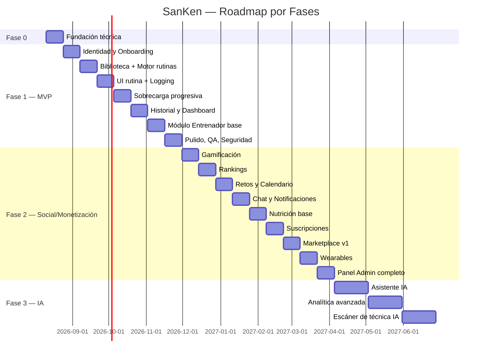

# SanKen — Roadmap por Fases y Sprint Planning

Cadencia: sprints de 2 semanas. Equipo de referencia: 1 arquitecto/tech lead, 2 backend (Laravel), 2 frontend web (React), 1-2 mobile (React Native), 1 diseñador UI/UX, 1 QA. Ajustable según equipo real.

**Paridad de plataformas (desde 2026-08-07):** salvo excepción justificada y documentada explícitamente en el sprint, toda funcionalidad de cara al usuario (tanto atleta como entrenador) se construye en **web y móvil dentro del mismo sprint**. Antes de esta fecha varios sprints se dividieron por plataforma a propósito (Sprint 3 solo móvil, Sprint 6 solo web); esa brecha se cerró con trabajo retroactivo — ver notas en cada sprint afectado.

## Fase 0 — Fundación (Sprint 0, 2 semanas)

**Objetivo:** dejar el esqueleto técnico listo para desarrollar sin fricción.

- Setup monorepo (`apps/api`, `apps/web`, `apps/mobile`, `packages/core`).
- Laravel 12 + Sanctum + estructura Clean Architecture (carpetas Domain/Application/Infrastructure/Http).
- Configuración MySQL + Redis + Horizon + Reverb (docker-compose / Sail).
- CI/CD base (lint, test, build) en GitHub Actions.
- Design system inicial en Figma (tokens de color, tipografía, componentes base) a partir del logo.
- Setup Vite + React + Tailwind + Shadcn en `apps/web`; setup Expo en `apps/mobile`.
- Definición de OpenAPI base y generación automática.

## Fase 1 — MVP ("la app entrena por ti")

### Sprint 1 — Identidad y Onboarding
- Registro/login/logout, verificación de email, recuperación de contraseña (Sanctum).
- Modelos y migraciones: `users`, `user_profiles`, `onboarding_responses`, `countries`, `cities`, `gyms`.
- Flujo de onboarding completo (backend + UI móvil, 1 pregunta por pantalla).
- Policies base de roles (`user`, `trainer`, `admin`).
- **Entregable:** un usuario puede registrarse y completar el onboarding end-to-end.

### Sprint 2 — Biblioteca de ejercicios + Motor de rutinas (core)
- Modelos: `muscle_groups`, `exercises`, `exercise_secondary_muscles`, `exercise_alternatives`.
- Seed de ~150 ejercicios base con datos completos.
- `Domain/Routine`: entidades, estrategias (Hipertrofia, Fuerza, Pérdida grasa, Resistencia), `RoutineGeneratorFactory`.
- `GenerateRoutineAction` encolada, disparada al completar onboarding.
- **Entregable:** al completar el onboarding, el usuario recibe una rutina generada automáticamente (visible vía API).

### Sprint 3 — UI de rutina + Registro de entrenamiento
- Pantallas móviles: Home, detalle de rutina, ejecución de sesión (registro de series).
- Modelos: `workout_sessions`, `workout_exercises`, `workout_sets`.
- Endpoints de logging completos + temporizador de descanso.
- **Entregable:** usuario puede ejecutar y registrar un entrenamiento completo desde el móvil.
- **Nota de paridad:** originalmente solo móvil (criterio de la época). Pendiente construir el equivalente en web (detalle de rutina, ejecución de sesión, registro de series, temporizador) — ver nota de paridad de plataformas al inicio del documento.

### Sprint 4 — Sobrecarga progresiva + Feedback de sesión
- `ProgressiveOverloadCalculator`, endpoint de feedback "¿Pudiste completar?".
- Recalculo de siguiente sesión (éxito → progresión; fallo → mantenimiento/reducción).
- Detección y registro de `personal_records`.
- **Entregable:** el ciclo semanal de progresión automática funciona de punta a punta.

### Sprint 5 — Historial, Estadísticas y Dashboard
- `body_measurements`, `user_stats_daily`, jobs de agregación.
- Dashboard: horas, series, toneladas, racha, PRs, gráficas (Recharts).
- Pantalla de historial de entrenamientos y medidas corporales.
- **Entregable:** dashboard de progreso funcional en web y móvil.

### Sprint 6 — Módulo Entrenador (base)
- `trainer_clients`, gestión de clientes, creación/edición manual de rutinas.
- Web app del entrenador (dashboard, lista de clientes, editor de rutina).
- Policy: rutinas `source=trainer` excluidas del motor automático.
- **Entregable:** un entrenador puede crear un cliente y asignarle una rutina manual.
- **Nota de paridad:** originalmente solo web (criterio de la época). Pendiente construir el equivalente en móvil (lista de clientes, agregar cliente, editor de rutina manual) — ver nota de paridad de plataformas al inicio del documento.

### Sprint 7 — Pulido MVP, QA y Seguridad
- 2FA, rate limiting, auditoría básica, hardening de Policies.
- Testing end-to-end (Pest + Playwright/Detox), corrección de bugs.
- Performance pass (índices, cache de rutina activa/dashboard).
- **Entregable:** MVP estable listo para beta cerrada.
- **Nota de Detox:** se evaluó durante la fase de testing infra — el entorno de desarrollo (WSL2) no tiene emulador Android ni simulador iOS disponible (sin `/dev/kvm`, sin Android SDK), así que Detox no se puede ejecutar ni verificar acá. Mobile quedó cubierto con Jest unitario (stores) en su lugar; Detox queda diferido hasta contar con un runner con KVM (ej. GitHub Actions con `reactivecircus/android-emulator-runner`) — no se escribió configuración sin poder probarla.

**Hito Fase 1:** Beta cerrada con usuarios reales — validar que el motor de rutinas y la progresión automática funcionan sin intervención manual.

## Fase 2 — Social, Gamificación, Nutrición y Monetización

### Sprint 8 — Gamificación
- `user_xp`, `achievements`, `user_achievements`, reglas de XP por evento (`WorkoutCompleted`, `PRBroken`, `StreakMilestone`).
- UI de logros e insignias, animaciones de subida de nivel.

### Sprint 9 — Rankings
- `ranking_snapshots`, jobs programados de recálculo, opt-in/opt-out.
- Pantallas de ranking (ciudad, país, gimnasio, edad, sexo, categorías de fuerza).

### Sprint 10 — Retos y Calendario
- `challenges`, `challenge_participants`, leaderboards en vivo (Reverb).
- Calendario completo (planeados, completados, recordatorios).

### Sprint 11 — Chat entrenador-cliente y notificaciones
- `chat_conversations`, `chat_messages` vía Reverb.
- Notificaciones push (Expo push + web push), centro de notificaciones in-app.

### Sprint 12 — Nutrición (base)
- Cálculo de calorías/macros/agua, `food_items`, `meal_logs`.
- Integración con base de datos de alimentos + escaneo de código de barras (móvil).

### Sprint 13 — Suscripciones y planes
- `subscriptions`, integración de pagos (Stripe/pasarela local), paywall de features premium (IA, stats avanzadas, nutrición completa, herramientas de entrenador).

### Sprint 14 — Marketplace de entrenadores (v1)
- `training_plans_marketplace`, perfil público de entrenador, compra de planes.

### Sprint 15 — Wearables
- `wearable_connections`, integración Apple Health, Google Fit, Garmin, Fitbit.

### Sprint 16 — Panel administrativo completo
- Gestión de usuarios/entrenadores/ejercicios, reportes, baneos, noticias, `audit_logs`, métricas globales.

**Hito Fase 2:** Producto con retención social + monetización activa (suscripción + marketplace).

## Fase 3 — Inteligencia Artificial y Diferenciación

### Sprint 17-18 — Asistente IA
- `/ai/chat`, contexto del usuario (rutina, progreso, historial) inyectado vía RAG ligero sobre sus propios datos.
- Casos: modificar rutina, explicar ejercicio, analizar progreso, dar consejos.

### Sprint 19-20 — Detección de estancamientos y analítica avanzada
- Modelos estadísticos/heurísticos sobre `user_stats_daily` y volumen por músculo para detectar plateaus.
- Panel de analítica avanzada (predicciones, evolución de fuerza por grupo muscular).

### Sprint 21-22 — Escáner de técnica con IA
- Captura de video en móvil → pipeline de análisis de pose/rango de movimiento (modelo de visión, posible proveedor externo) → feedback estructurado.

**Hito Fase 3:** SanKen como plataforma con IA aplicada real, no cosmética — diferenciador competitivo frente a Nike Training Club/Whoop/apps genéricas de rutinas.

## Resumen visual de fases

## Definition of Done (aplica a todo sprint)
- Toda funcionalidad de cara al usuario se entrega en web y móvil dentro del mismo sprint (ver nota de paridad de plataformas), salvo excepción justificada explícitamente en el sprint.
- Código con tests (Pest backend, Vitest/RTL frontend, mínimo happy-path + 1 edge case).
- Endpoint documentado en OpenAPI.
- Revisión de diseño contra design system (sin colores/espaciados fuera de tokens).
- Sin regresiones en CI (lint, tipos, tests, build).
- Revisado por al menos un par antes de merge a `main`.
